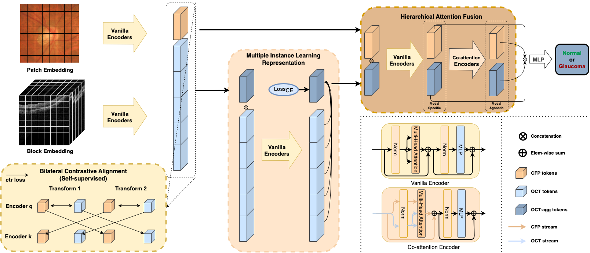

# Representation, Alignment, Fusion: A Generic Transformer-based Framework for Multi-modal Glaucoma Recognition
## Abstract
Early glaucoma can be diagnosed with various modalities based on morphological features. However, most existing automated solutions rely on single-modality, such as Color Fundus Photography(CFP) which lacks 3D structural information, or Optical Coherence Tomography (OCT) which suffers from insufficient specificity for glaucoma. To effectively detect glaucoma with CFP and OCT, we propose a generic multi-modal Transformer-based framework for glaucoma, MM-RAF. Our framework is implemented with pure self-attention mechanisms and consists of three simple and effective modules: Bilateral Contrastive Alignment (BCA) aligns both modalities into the same semantic space to bridge the semantic gap; Multiple Instance Learning Representation (MILR) aggregates multiple OCT B-scans into a semantic structure and downsizes the scale of the OCT branch; Hierarchical Attention Fusion (HAF) enhances the cross-modality interaction capability with spatial information. By incorporating three modules, our framework can effectively handle cross-modality interaction between different modalities with huge disparity. The experimental results show that the framework outperforms the existing multi-modal methods of this task and is robust even with a clinical small dataset. Moreover, by visualizing, OCT can reveal the subtle abnormalities in CFP, indicating that the relationship between various modalities is captured.
## Model Overview

## News
[07-01-2023] We create the repo for our MICCAI2023 paper. The code will be released as soon as possible. 
